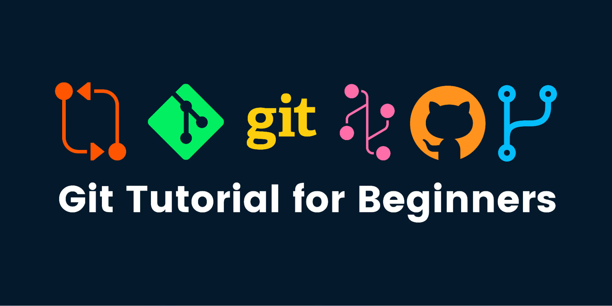

# Git Tutorial Repository 🚀

Welcome to the **Git Tutorial Repository**! This repo is powered by [DeepSeek](https://www.deepseek.com/) ai and designed to help you learn Git, a distributed version control system that allows developers to track changes in their code, collaborate seamlessly, and manage projects efficiently. Whether you're new to Git or brushing up your skills, this tutorial will guide you through essential concepts and workflows.

## 📚 What is Git?

Git is a free, open-source version control system created by Linus Torvalds. It helps you:
- Track changes in your code over time.
- Collaborate with others without overwriting work.
- Revert to previous versions of your project.
- Manage multiple branches of development.

This repository includes hands-on examples and a [cheatsheet](https://github.com/Ayminjf/git-tutorial/blob/main/cheatsheet.md) to help you master Git commands and workflows.


## 🛠️ Getting Started

### 1. Clone the Repository
To get started, clone this repo to your local machine:
```bash
git clone https://github.com/arwinux/git-tutorial
cd git-tutorial
```

### 2. Install Git
If you don’t have Git installed, download it from [git-scm.com](https://git-scm.com/).

## 🌿 Using Branches in This Tutorial

This repo uses branches to isolate different Git concepts. Each branch focuses on a specific topic (e.g., `basics`, `branching`, `collaboration`, `advanced`). Follow these steps to explore:

### Step 1: List Available Branches
```bash
git branch -a
```

### Step 2: Switch to a Branch
For example, to learn about branching workflows, use:
```bash
git checkout branching
```

### Step 3: Explore the Branch
For example, to learn about branching workflows, use:
- Study the example files and comments.

- Practice commands listed in the [cheatsheet.md](https://github.com/Ayminjf/git-tutorial/blob/main/cheatsheet.md).

- Return to the main branch when done:
```bash
git checkout main
```
## 📂 Branch Overview

| Branch Name     | Topic Covered                                        |
|----------------|------------------------------------------------------|
| `basics`       | Initializing repos, staging, committing             |
| `branching`    | Creating, merging, and rebasing branches           |
| `collaboration`| Remote repos, fetching, pushing, and pulling       |
| `advanced`     | Stashing, resetting, tags, and cherry-picking      |


## 🚨 Practice Workflow

This repo uses branches to isolate different Git concepts. Each branch focuses on a specific topic (e.g., `basics`, `branching`, `collaboration`, `advanced`). Follow these steps to explore:

### 1. Create a New Branch for your experiments:
```bash
git checkout -b my-experiment
```

### 2. Make changes, stage, and commit them:
```bash
git add .
git commit -m "Add experiment feature"
```

### 3. Merge your branch back to `main` when done:
```bash
git checkout main
git merge my-experiment
```

## 📄 Cheatsheet Quick Access

A handy reference for Git commands is included in [cheatsheet.md](https://github.com/Ayminjf/git-tutorial/blob/main/cheatsheet.md) Use it to review commands for:

- Basic workflows

- Branch management

- Team collaboration

- Advanced techniques

## 🤝 Contributing

Feel free to contribute to this tutorial! Fork the repo, create a branch for your changes, and submit a pull request.

### Happy Coding! 🎉
### Let’s master Git together! 💻


### Key Features:
1. **Introduction to Git**: Explains why Git is important.
2. **Branch Navigation**: Guides users on how to switch between tutorial branches.
3. **Structured Workflow**: Provides a clear practice workflow for experimentation.
4. **Cheatsheet Integration**: Links to your existing `cheatsheet.md`.

Let me know if you’d like to tweak any sections! 😊